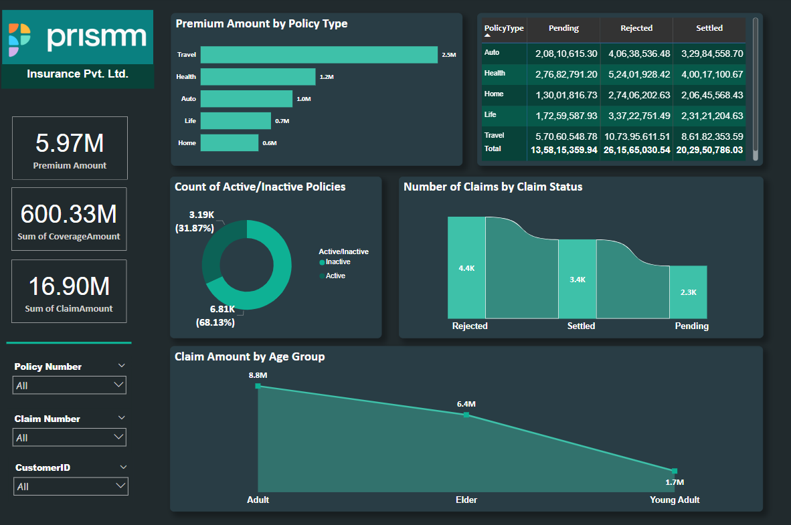
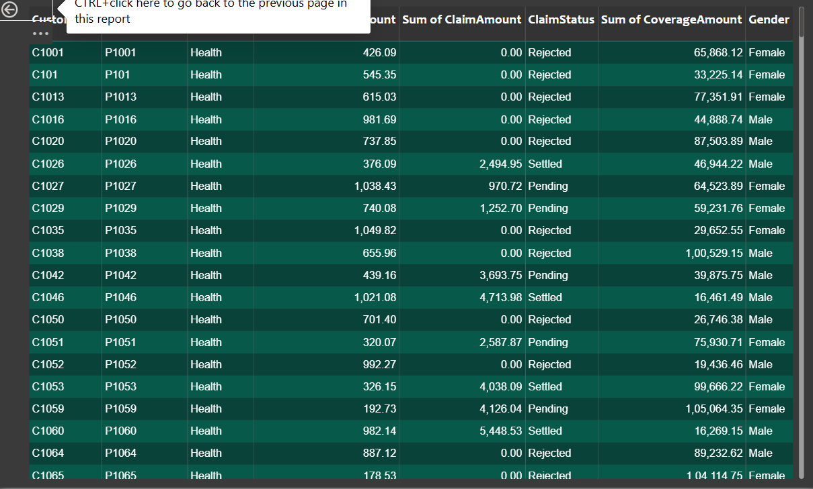
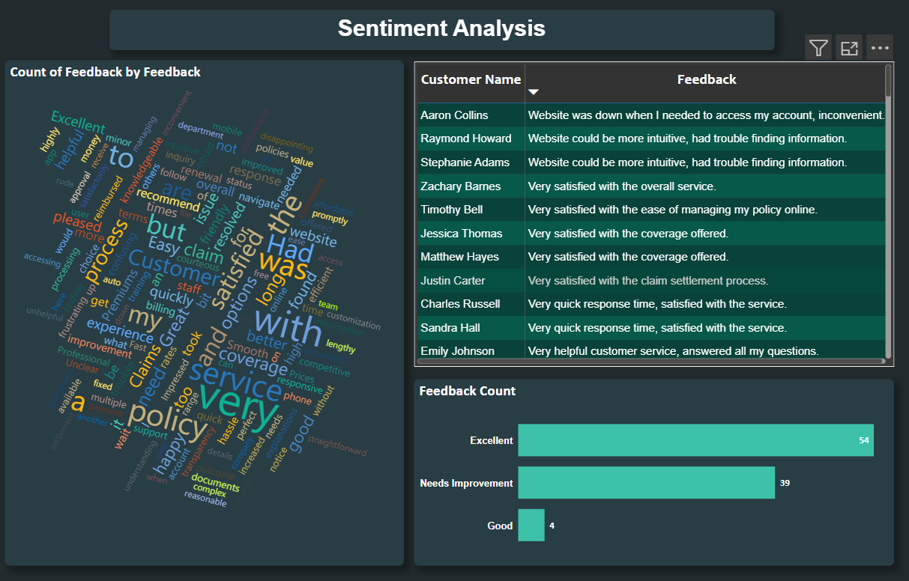

# 🛡️ Insurance Analytics Dashboard – Prismm Insurance Pvt. Ltd.

This Power BI project delivers a comprehensive insurance analytics solution for Prismm Insurance Private Limited. The dashboard is designed to provide actionable insights into premium collection, customer sentiments, and operational metrics, all within an interactive and user-friendly interface.

---

## 📊 Features

- **Dynamic Dashboard**: Intuitive layout summarizing all critical KPIs.
- **Key KPIs**:
  - Total Premium Collected
  - Active Policies
  - Claims Frequency
- **Drill-Through Capabilities**: Dive deeper into customer specific metrics.
- **Sentiment Analysis**: Categorizes customer feedback (Excellent, Needs Improvemnet and Good) to identify service gaps.
- **Filterable Dimensions**: Slice data by policy No., Claim No., and CustomerID.

---

## 🧠 Insights

Here are a few key insights uncovered through the dashboard:

- 💰 **Premium Dominance**: The majority of collected premiums stem from auto and health policy lines.
- 📉 **Claim Concentration**: Specific regions show higher claim frequencies, indicating potential fraud risk or higher service demand.
- 😊 **Customer Sentiment**: Positive feedback correlates strongly with regions showing quicker claim turnaround times.
- 🔍 **Drill-Through Utility**: Enables investigation into underperforming agents or policy types driving low retention.

---

## 🛠️ Technologies Used

| Tool        | Description                         |
|-------------|-------------------------------------|
| Power BI    | Data modeling, DAX, report visuals  |
| DAX         | Calculated KPIs, measures, filters  |
| Power Query | Data shaping and transformation     |
| Custom Visuals | Enhanced data storytelling        |

---

## 📁 File Structure

- `Insurance.pbix` – Complete Power BI report file with visuals, dataset, and modeling.
- Drill-through pages are embedded for customer-level analysis.
- Sentiment classification is built using rule-based text fields.
---

## 📸 Screenshots
**Main Dashboard (click to drill through):**

**Drill-Through Page:**

**Sentimental-Analysis:**

---

